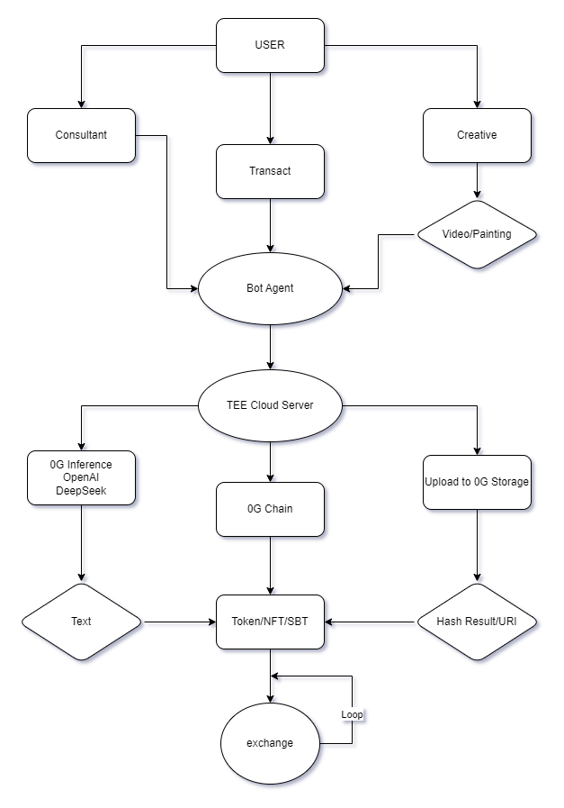

# Basic Info

Project Name: Any Creative

# Project Details

## Introduction

Any-Creative is an AI Agent driven intelligent robot that provides users with a platform to interact with the 
0G network on Phala-cloud's tee environment, unleash their creativity, and fully control the ownership of their works without intermediaries. It provides a range of services such as Create animations on Local Native Environment, Upload media, Consulting creativity, Issuing tokens, Send transaction, Check account balances on the 0G network.

## Done during hackathon

### Eliza 0G Plugin
- [×] Wallet Provider
- [×] Upload file action
- [×] Create Media action
- [×] Transfer token action
- [×] Check balance action
- [×] Issue Token action
- [×] Issue NFT action

### Eliza Telegram Client Iteration
- [×] Client receives file redirection

### Eliza Core Plugin Inference Generation Iteration
- [×] 0G Compute Inference

### Contract
- [×] ERC20, ERC721 factory contracts

### Multimodal Model
- [×] Local image generated video multimodal workflow API

## Project architecture

## PPT

https://any-creative-demonstrate.vercel.app/

## Telegram Bot

https://t.me/AnyCreativeBot

## User Tutorial

/consultant - Start a consultation with a AI expert, Get any creative ideas.

/createMedia - Create your own artwork (a painting, a video).

/uploadFile - Upload file to 0G Storage.

/transact -  Execute any transaction you want on 0G, such as: "transfer 10 a0gi to xxxxx", It will transfer your tokens on 0G network.

/issueToken - Intelligent MEME Coin issuance request, Issue coins for your own collection of works.

/issueNFT - Intelligent NFT issuance request, Issue coins for your own collection of works.

/checBalacne - Check your account or any address's account balance on 0G network.

/help - Show this help message.
